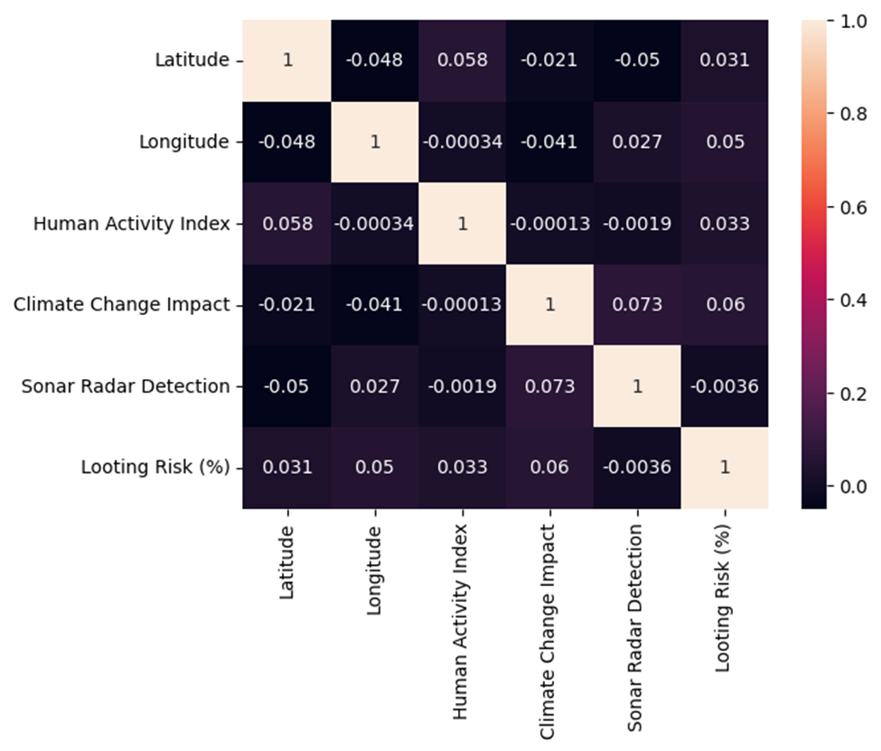

# [Archaeological Site Prediction]

## Repository Link

[https://github.com/Wiebke-Engler/Machine_learning_tensorflow]

## Description

[Short project description here. Briefly summarize the problem you are trying to solve and the approach you're taking.]
The project is about the prediction of potential excavation sites based on severals parameters. This is suppose to help identify the most promising sites. 
Due to the data I chose a one class identification as a form of novalty detection and a linear regression using the exsisting AI score as the target feature.
### Task Type

[Image Classification / Chatbot / Regression / Clustering / Other]
Novalty detection and linear Regression

### Results Summary

- **Best Model:** Novalty detection LocalOutlierFactor
                Linear regression 
- **Evaluation Metric:** accuracy novalty detection: postive cases 100%
                                                   negative cases 12%
                       linear regression: MAPE 18.75%/17.46%
                       
- **Result:** See Evaluation Metrics

## Documentation

1. **[Literature Review](/workspaces/Machine_learning_tensorflow/0_LiteratureReview/README.md)**
2. **[Dataset Characteristics](/workspaces/Machine_learning_tensorflow/1_DatasetCharacteristics/README.md)**
3. **[Baseline Model](/workspaces/Machine_learning_tensorflow/2_BaselineModel/README.md)**
4. **[Model Definition and Evaluation](/workspaces/Machine_learning_tensorflow/3_Model/README.md)**
5. **[Presentation](/workspaces/Machine_learning_tensorflow/4_Presentation/README.md)**

## Cover Image

